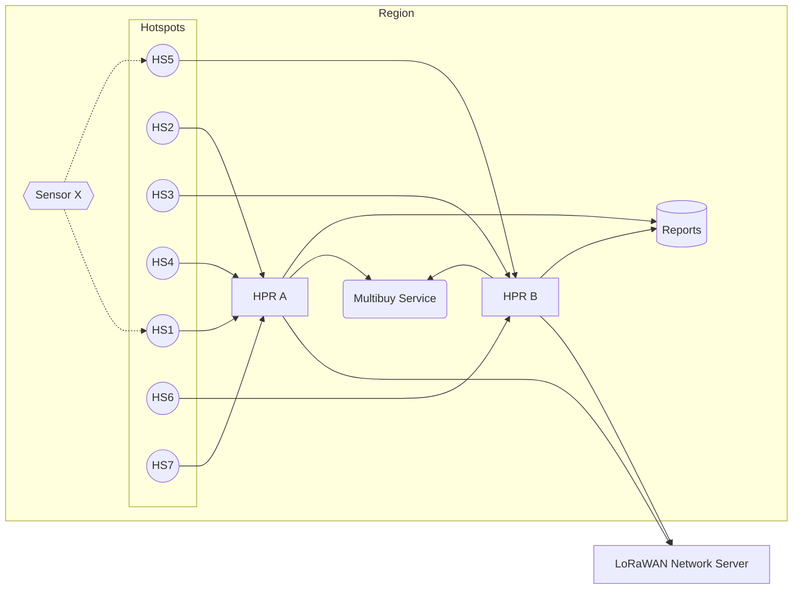

# Multibuy Service

In the Helium Packet Router architecture, there are multiple load balanced HPRs per region (Europe, Asia, etc). This presents the chance that two geographically close Hotspots in one region actually report to different instances of HPR. Through this double connection, HPRs alone cannot determine whether a packet has already been purchased by the network already.

e.g. One Hotspot reports to HPR A, One Hotspot reports to HPR B. The 'multibuy' is set to 'one', the network may incorrectly transmit two packet reports to the LNS (and packet verifier).

Multi-Buy service fixes this non-communication by allowing HPRs to communicate within a region in order to limit the number of packets purchased by the network (based on multi-buy preference).

As packets come in to HPR A and HPR B, they will check in with Multi-Buy service to ensure the total requested packets is not exceeded.

## Features

- Distributed packet counter across load-balanced HPR instances
- Hotspot and region deny lists
- Prometheus metrics endpoint
- Automatic cache cleanup (configurable, default 30 minutes)
- Graceful shutdown via SIGTERM/SIGINT

## Diagram



## Building

```bash
cargo build --release
```

## Running

```bash
# With config file
multi_buy_service -c settings.toml server

# Or with environment variables only
MB__GRPC_LISTEN=0.0.0.0:6080 multi_buy_service server
```

## Testing

```bash
cargo nextest run
```

## Docker

```bash
docker build -t multibuy-service .

docker run -p 6080:6080 -p 19011:19011 multibuy-service
```

## Configuration

All settings can be configured via a TOML file or environment variables prefixed with `MB__` (double-underscore separator).

```toml
# log settings for the application (RUST_LOG format)
# Env: MB__LOG
log = "INFO"

# Listen address for gRPC requests
# Env: MB__GRPC_LISTEN
grpc_listen = "0.0.0.0:6080"

# Base58-encoded hotspot public keys to deny
# Env: MB__DENIED_HOTSPOTS
# denied_hotspots = []

# Region names to deny (e.g., "US915", "EU868")
# Env: MB__DENIED_REGIONS
# denied_regions = []

# Prometheus metrics endpoint
[metrics]
# Env: MB__METRICS__ENDPOINT
endpoint = "0.0.0.0:19011"

# Cache cleanup interval (humantime format)
# Env: MB__CLEANUP_TIMEOUT
# cleanup_timeout = "30 minutes"
```

### Environment Variables

| Variable | Description | Default |
|----------|-------------|---------|
| `MB__LOG` | RUST_LOG format log level | `INFO` |
| `MB__GRPC_LISTEN` | gRPC listen address | `0.0.0.0:6080` |
| `MB__METRICS__ENDPOINT` | Prometheus metrics listen address | `0.0.0.0:19011` |
| `MB__CLEANUP_TIMEOUT` | Cache cleanup interval | `30 minutes` |
| `MB__DENIED_HOTSPOTS` | Base58-encoded hotspot public keys to deny | `[]` |
| `MB__DENIED_REGIONS` | Region names to deny (e.g., US915, EU868) | `[]` |

## Metrics

| Metric | Type | Description |
|--------|------|-------------|
| `multi_buy_hit_total` | Counter | Total inc requests received |
| `multi_buy_denied_total` | Counter | Total requests denied by deny lists |
| `multi_buy_cache_size` | Gauge | Number of entries in the cache |
| `multi_buy_cache_cleaned_total` | Counter | Total entries removed by cache cleanup |

Metrics are exposed at `http://{endpoint}/metrics` in Prometheus format.
